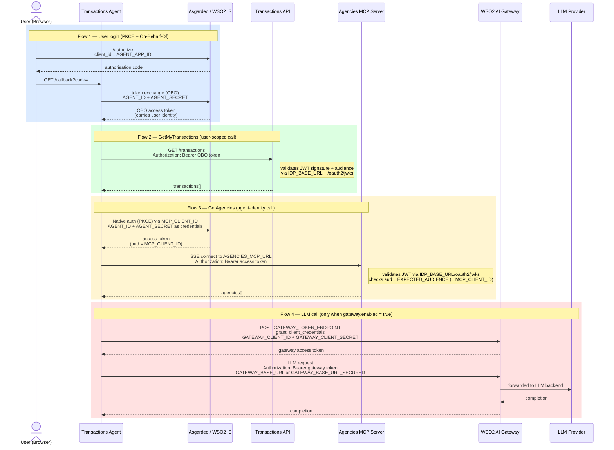

# Transactions AI Agent — Architecture

This document describes the architecture, identity model, and security properties of the Transactions AI Agent and Agencies MCP Server. For configuration, environment variables, and startup instructions see the [README](../README.md).

---

## Overview

| Component | Port | Language | Purpose |
|---|---|---|---|
| `transactions-api` | 8010 | Python / FastAPI | Stores and serves transaction data; validates OBO JWTs |
| `transactions-agent` | 8011 | Python / FastAPI | AI agent via WebSocket; drives OBO consent and MCP tool calls |
| `agencies-mcp-server` | 8012 | Python / FastMCP | MCP SSE server; exposes `get_agencies` tool; validates agent bearer tokens |
| `app` (modified) | 5173 | React / JSX | `/transactions` page with chat UI and consent popup |

The `transactions-agent` folder contains **three interchangeable implementations** of the same agent, each using a different AI framework:

| Subfolder | Framework | Key dependency |
|---|---|---|
| `autogen-agent/` | Microsoft AutoGen | `autogen-agentchat`, `autogen-ext` |
| `strands-agent/` | AWS Strands Agents | `strands-agents`, `boto3` (supports Bedrock) |
| `langchain-agent/` | LangChain | `langchain`, `langchain-openai`, `langchain-anthropic` |

All three share the same `app/` (prompt, tools, MCP client, gateway) and `auth/` (token flows) layers at the `transactions-agent/` root.

---

## Architecture

```
Browser (React)
    │  WebSocket ws://localhost:8011/chat?session_id=<uuid>
    ▼
transactions-agent (port 8011)
    │  GET /transactions  Bearer <OBO token>           ← user-scoped call
    ▼
transactions-api (port 8010)
    │  Validates JWT via IDP JWKS endpoint
    │  Returns transactions for token_data.sub (user identity from OBO token)
    ▼
In-memory store (keyed by user sub)

transactions-agent (port 8011)
    │  SSE connect to agencies-mcp-server              ← agent-identity call
    │  Authorization: Bearer <agent token (aud = MCP_CLIENT_ID)>
    ▼
agencies-mcp-server (port 8012)
    │  Validates bearer token via IDP JWKS (aud = EXPECTED_AUDIENCE)
    │  Calls get_agencies MCP tool
    ▼
Static branch/agency data
```

---

## Identity Model

The agent uses **three independent sets of credentials**, each with a distinct identity scope:

| Credential | Kind | Used for |
|---|---|---|
| `AGENT_APP_ID` | OAuth2 public application | Identifies the agent app to the IDP in the PKCE login flow (OBO) |
| `AGENT_ID` + `AGENT_SECRET` | IS agent principal (like a user) | Authenticates the agent itself in the native auth step of both OBO and MCP token flows |
| `MCP_CLIENT_ID` | OAuth2 public application | Separate app for MCP access — its client ID becomes the `aud` claim validated by the MCP server |
| `GATEWAY_CLIENT_ID` + `GATEWAY_CLIENT_SECRET` | OAuth2 confidential app | LLM API access via WSO2 AI Gateway (optional; not involved in user data or MCP) |

`MCP_CLIENT_ID` is intentionally separate from `AGENT_APP_ID`. Having two distinct applications lets the MCP server validate the `aud` claim independently — a token issued for the user auth app cannot be replayed against the MCP server.

---

## Security Pattern — On-Behalf-Of (OBO) Token Flow

Used by `GetMyTransactions` to access user-specific data. The OBO pattern ensures the agent can only read data belonging to the currently authenticated user.

Each framework has its own `SecureTool` wrapper (`SecureFunctionTool` / `SecureStrandsTool` / `SecureLangChainTool`) that implements the same flow:

1. User sends a message (e.g. *"Show me my recent transactions"*)
2. Agent calls the `GetMyTransactions` tool
3. The secure tool wrapper intercepts — the `token` parameter is **never shown to the LLM**
4. No cached OBO token exists → agent sends an `auth_request` WebSocket message to the frontend
5. Frontend displays an "Authorise Access" button with the required scopes
6. User clicks → OAuth popup opens at the IDP (`/authorize` with PKCE)
7. User consents → IDP redirects to `http://localhost:8011/callback?code=X&state=Y`
8. Agent exchanges the auth code + agent credentials for an OBO token (`sub=user, act.sub=agent`)
9. OBO token is injected into the tool call → `GET /transactions` is called with `Bearer <obo_token>`
10. Backend validates the JWT, checks the `read_transactions` scope, returns `token_data.sub`'s transactions
11. Token is cached (TTL 1 hour) — subsequent requests in the session skip the consent step

```
OBO token structure:
  sub     = <user's IDP ID>          ← who the data belongs to
  act.sub = <agent's client ID>      ← who is acting on their behalf
  scope   = "read_transactions"
```

---

## Transactions AI Agent — Token Flows

The agent uses **three independent sets of credentials**, each with a different purpose and lifetime. The diagram below shows which environment variable is used at each step.



## Security Pattern — Agent-Identity Token Flow (MCP)

Used by `GetAgencies` to call the Agencies MCP Server. The MCP resource contains no user-specific data, so no user consent is needed — the agent authenticates as itself.

1. Agent calls the `GetAgencies` tool
2. The secure tool wrapper calls `AutogenAuthManager.get_oauth_token(AGENT_TOKEN)`
3. If no cached token exists, the auth manager initiates a **native auth PKCE flow**:
   - Starts a PKCE authorization code flow against `MCP_CLIENT_ID`
   - Submits `AGENT_ID` / `AGENT_SECRET` as username/password to the IDP native auth endpoint (no browser redirect)
   - Receives an authorization code, exchanges it for an access token
4. Resulting token has `aud = MCP_CLIENT_ID`
5. Token is sent as `Authorization: Bearer <token>` when opening the SSE connection to the MCP server
6. MCP server's `BearerAuthMiddleware` validates the token against the IDP's JWKS and checks `aud == EXPECTED_AUDIENCE` (= `MCP_CLIENT_ID`)
7. On success, the MCP session is established and `get_agencies` is called
8. Token is cached per session (TTL 1 hour)

```
Agent token structure:
  sub = <AGENT_ID>                   ← the agent's own identity
  aud = <MCP_CLIENT_ID>              ← the application that requested the token
```

The JWKS used for validation is cached with a 1-hour TTL. If all cached keys fail validation (key rotation), the cache is invalidated and the JWKS is refetched once before the request is rejected.

---

## LLM Provider Support

| Provider | Default model | Frameworks |
|---|---|---|
| `openai` | `gpt-4o-mini` | autogen, strands, langchain |
| `gemini` | `gemini-2.5-flash-lite` | autogen, strands, langchain |
| `anthropic` | `claude-sonnet-4-5-20250929` | autogen, strands, langchain |
| `bedrock` | `eu.anthropic.claude-sonnet-4-6-20250514-v1:0` | **strands only** |
| `mistral` | `mistral-small-latest` | autogen, strands, langchain |

Bedrock uses `AWS_DEFAULT_REGION` (default `eu-north-1`). Without the gateway, calls go directly to the Bedrock Converse API via `boto3`. With `gateway.enabled: true`, calls are routed via the WSO2 gateway using OAuth bearer tokens — no AWS credentials needed in that case.

### WSO2 AI Gateway (LLM routing)

When `gateway.enabled: true`, all LLM calls are routed via the WSO2 AI Gateway rather than a direct provider API key. The agent authenticates to the gateway using the OAuth2 client credentials grant (`GATEWAY_CLIENT_ID` / `GATEWAY_CLIENT_SECRET`).

Token refresh behaviour (`GatewayTokenManager` in `app/gateway.py`):
- Token is cached in memory and refreshed automatically 30 seconds before `expires_in` expires
- An `asyncio.Lock` prevents concurrent refresh storms under high load
- If the token endpoint is unreachable, the error propagates as an agent-level exception

For Bedrock via gateway, the bearer token is injected via a botocore `before-send` event (not an httpx auth handler) because botocore runs in a thread pool — the token is fetched using `run_coroutine_threadsafe` against the main event loop.

---

## Provisioning Demo Data

The `transactions-api` uses an in-memory store. Provisioning is triggered automatically when a new user registers: the `/signup` endpoint in `server/server.js` fires two async steps:

1. **Role assignment** — assigns the `Read_Transactions` role, which gates access to the `/transactions` page and enables the OBO scope consent flow
2. **Transaction seeding** — calls `POST /admin/provision` on the transactions API to generate ~60 demo transactions over the last 90 days

Both steps are fire-and-forget — failures are logged as warnings but do not affect the signup response. The same flow runs for `/business-signup`.

The generator creates deterministic data seeded by `hash(user_sub)` — the same user always gets the same transactions:
- Monthly salary credit on the 1st of each month
- Regular grocery, dining, transport, shopping, utilities, and health debits

Since the store is in-memory, data is lost on service restart.

Data can also be provisioned by clicking the provision data link in the user profile for existing users (after a demo restart for example).

---

## File Structure

```
bank-of-asgard/
├── docker-compose.yml               # Orchestrates services; use --profile to pick an agent
├── llm_config.yaml                  # LLM provider selection (mounted at runtime)
│
├── agencies-mcp-server/             # FastMCP SSE server — branch/agency lookup
│   ├── server.py                    # get_agencies tool + BearerAuthMiddleware (pure ASGI)
│   ├── requirements.txt
│   └── .env.example
│
├── transactions-api/                # FastAPI — transaction data service
│   ├── app/
│   │   ├── main.py                  # Routes: GET /transactions, POST /admin/provision
│   │   ├── dependencies.py          # JWKS-based JWT validation + scope enforcement
│   │   ├── schemas.py               # Pydantic models (Transaction, ProvisionRequest, etc.)
│   │   └── data.py                  # In-memory store + sample data generator
│   ├── requirements.txt
│   ├── Dockerfile
│   └── .env.example
│
├── transactions-agent/              # AI agent — three interchangeable implementations
│   ├── app/                         # Shared across all implementations
│   │   ├── gateway.py               # GatewayTokenManager + GatewayBearerAuth (LLM gateway)
│   │   ├── mcp_agencies.py          # call_agencies_mcp — one-shot MCP SSE session
│   │   ├── tools.py                 # get_my_transactions (OBO) + get_agencies (MCP)
│   │   └── prompt.py                # Banking-focused system prompt + welcome message
│   ├── auth/                        # Shared OAuth plumbing
│   │   ├── auth_manager.py          # AutogenAuthManager: OBO + agent token flows
│   │   ├── auth_schema.py           # Validates manager has message_handler for OBO
│   │   ├── models.py                # OAuthTokenType, AuthConfig, AuthRequestMessage
│   │   └── token_manager.py         # TTLCache-based per-session token storage
│   ├── autogen-agent/               # AutoGen implementation
│   │   ├── service.py               # WebSocket /chat + /callback endpoints
│   │   ├── tool.py                  # SecureFunctionTool: strips token from LLM schema
│   │   ├── requirements.txt
│   │   └── Dockerfile
│   ├── strands-agent/               # AWS Strands implementation (supports Bedrock)
│   │   ├── service.py
│   │   ├── tool.py                  # SecureStrandsTool
│   │   ├── requirements.txt
│   │   └── Dockerfile
│   ├── langchain-agent/             # LangChain implementation
│   │   ├── service.py
│   │   ├── tool.py                  # SecureLangChainTool
│   │   ├── requirements.txt
│   │   └── Dockerfile
│   └── .env.example
│
├── server/                          # Node.js / Express backend
│   ├── server.js                    # Auto role assignment + provisioning on signup
│   └── middleware/
│       └── auth.js
│
└── app/                             # React frontend
    └── src/
        ├── pages/
        │   └── transactions.jsx     # /transactions page (chat + info panel)
        └── components/
            └── transactions/
                └── ChatComponent.jsx # WebSocket chat + OBO consent popup
```

---

## End-to-End Test Checklist

### OBO flow (transactions)

1. Register a new user via the signup form
2. Check server logs — confirm both messages appear:
   - `POST /signup: user assigned to Read_Transactions role`
   - `POST /signup: transactions provisioned`
3. Log in and navigate to the user profile — verify the **"Open Transaction Assistant"** button appears
4. Click it — `/transactions` loads with the chat UI
5. Type: *"Show me my recent transactions"*
6. Verify an **"Authorise Access"** panel appears with the `read_transactions` scope chip
7. Click **"Authorise Access"** — IDP popup opens, complete login, popup closes
8. Chat shows: *"Authorisation complete! Fetching your transactions now..."*
9. Agent responds with a formatted list (not raw JSON)
10. Ask: *"How much did I spend on dining?"* — agent summarises without triggering auth again (token cached)

### MCP flow (agencies)

1. Ensure the MCP server is running and `MCP_CLIENT_ID` is set
2. Ask: *"Are there any Bank of Asgard branches in Paris?"*
3. Agent log shows `[TOKEN FETCH] type=AGENT_TOKEN resource=agencies_mcp`
4. MCP server log shows `Token claims — aud='<MCP_CLIENT_ID>'` and `Expected audience: '<MCP_CLIENT_ID>'`
5. Agent responds with a list of Paris branches including addresses, phone numbers, and hours

---

## Security Properties

| Property | Mechanism |
|---|---|
| Token never visible to LLM | Each `SecureTool` wrapper strips `token: OAuthToken` from the function schema before passing it to the LLM |
| Per-session isolation | Each WebSocket gets its own `AutogenAuthManager` + `TokenManager` — no cross-user token leakage |
| Replay protection | `_pending_auths.pop(state)` atomically removes the OBO entry; duplicate callbacks are rejected |
| Authorization timeout | `asyncio.wait_for(future, timeout=300s)` — agent does not hang if the user closes the popup |
| Scope enforcement (API) | Backend independently validates JWT scopes on every request, regardless of what the agent presents |
| OBO audit trail | JWT `act` claim identifies the agent separately from the user (`sub`) |
| Eager validation | `AuthSchema.__init__` raises at startup if OBO is configured without a `message_handler` |
| MCP audience isolation | `MCP_CLIENT_ID` is a separate application from `AGENT_APP_ID` — a user-auth token cannot be used to call the MCP server |
| MCP transport security | Pure ASGI `BearerAuthMiddleware` validates every inbound request before any MCP protocol handling; SSE streaming is unaffected |
| JWKS rotation resilience | MCP server invalidates its JWKS cache and retries once on key-validation failure, recovering from IDP key rotation without a restart |
